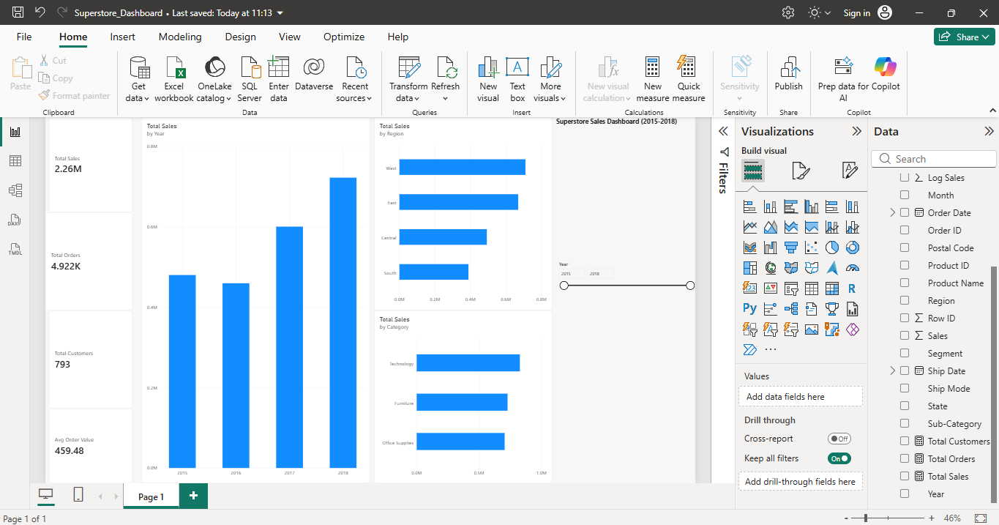

# Superstore Sales Analysis

Built an end-to-end data analytics project on 9,800 US retail orders (2015-2018) to uncover sales trends, customer value, and regional performance. The workflow covers data cleaning, exploratory data analysis (EDA), customer segmentation, time-series forecasting, and business intelligence reporting.

## Key Findings
- Total sales: $2.26M across 4,922 orders and 793 customers (average order value $459.48).
- Sales dipped 4.3% in 2016, then grew 30.6% in 2017 and 20.3% in 2018.
- Technology is the top category; West is the top region.
- Top 5 states generate about 52% of total sales.
- 11.7% of rows are statistical outliers but make up about 64% of revenue. I kept them because they are genuine high-value orders, not errors.
- RFM segmentation: Champions and Loyal customers contribute about 76% of revenue.
- Forecasting: a Holt-Winters model achieved 19.8% MAPE on 2018 test data, beating a seasonal-naive baseline (24.9%). It projects 2019 sales of about $899K (+24.5% vs 2018). With only 4 years of data, this is an estimate, not a guarantee.

## Limitation
The dataset has no Profit, Quantity or Discount columns, so profitability could not be analysed.

## Tools
Python (Pandas, NumPy, Matplotlib, Seaborn, Statsmodels), Google Colab, Power BI

## Files
- `Superstore_Sales.ipynb`: cleaning, EDA, RFM, forecasting
- `superstore_cleaned.csv`: cleaned dataset
- `customer_rfm.csv`: RFM scores and customer groups
- `Superstore_Dashboard.pbix`: Power BI dashboard
- `dashboard.png`: dashboard screenshot
